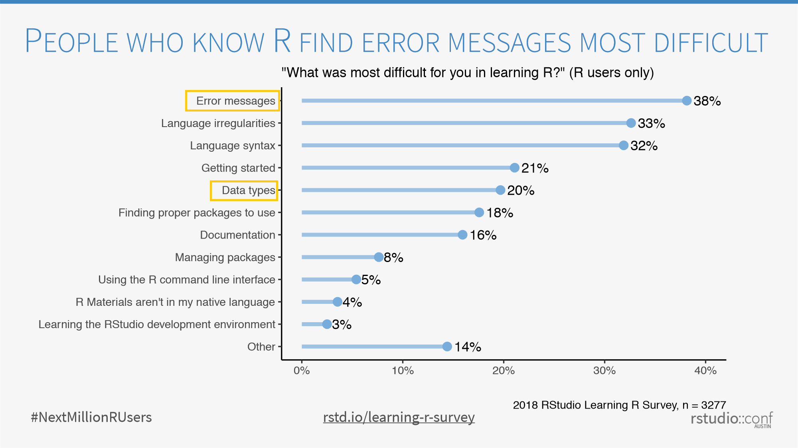

<!-- EDIT IN README.RMD -->

According to a recent survey by RStudio the biggest barriers to learning R include interpreting error messages and understanding data types.
It seems that most errors are caused by R looking for something that is not there [ref], and often times this is because the wrong type of object has been provided.

```{r out.width="75%", echo=FALSE}

```

Since attempting to investigate specific errors would be impossible, this workshop will take a look at the different data types and the types of values or operations they are (un?)suitable for.
The most data type we are most familiar with is probably the dataframe, so in the workshop we will take the dataframe as a starting point, and look at the similarities and differences with other data types such as lists, matrices and vectors.
We will then go a step deeper to look at the four main types of data available in R.

__Please bring a laptop__ with you as we will try some things out to see if the meet our expectations.  
Please come along if you are surprised by this, or if you can explain it:

```{r}

identical(
  1:5,
  c(1, 2, 3, 4, 5)
)

```


