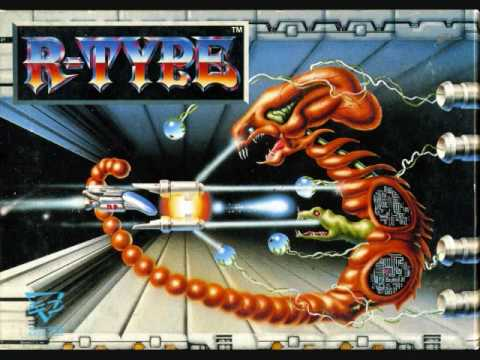

```{r setup, include=FALSE}

knitr::opts_chunk$set(eval = FALSE)

```

<!--  -->


# Data types

## Dataframe

+ 2D "spreadsheet"
+ can have names
  + (or other meta data)
+ list
  + columns can contain different types of data

```{r}

mtcars
dim(mtcars)
class(mtcars)
attributes(mtcars)

typeof(mtcars)

```

## Matrices

+ Similarities with dataframe
  + 2D
  + can have names etc.
+ Differeces from df
  + 1 data type only

```{r}

m <- matrix(1:12, 4)#, dimnames = list(c('J', 'A'), 2000 + 1:6))
m

matrix(letters, ncol = 2)

class(m)
typeof(m)

mode(m)

```

__Other important point__
+ column major
  + see `byrow = TRUE`
  + eg spatial bounding boxes

Useful for..?

+ Modelling
  + Statistical ~ eg lm = matrix
  + Simulations
    + parameters
    + results?
+ Because faster than df
+ Easy to aggregate
  + `apply` etc (which you should not use for df's)
  + see `apply(iris[-5], 1, '+', 100)`

```{r}

lm1 <- lm(Petal.Length ~ Petal.Width + Species, iris)
model.matrix(lm1)

```

## nD arrays

+ Like matrices
  + but with layers / slices

```{r}

iris3
iris3[1:5, 1:2, 1:2]

dim(iris3)
dimnames(iris3)

class(iris3)
typeof(iris3)
mode(iris3)
attributes(iris3)

```

+ Useful for:
  + storing simulation results
    + eg each replicate in a different slice
  + easy to aggregate like matrices

Example experiment  
What if you had different treatments

```{r}

a <- array(1:24, c(2, 4, 3), dimnames = list(c('J', 'A'), paste0('gen_', 1:4),
                                        paste0('replicate_', 1:3)))

a
```

## Lists

+ Similar to df:
  + elements can have different types of data
+ Different from df:
  + Elments can vary in length
    + c.f dataframe cols are all same length

+ Great for stuff
+ `lapply`

```{r}

list(a = 1:5, b = c('a', 'b', 'c'), c = list(c1 = 100:105, c2 = 200:205))

```

### Using lists

```{r}

str(lm1)

coef(lm1)
lm1$coef
lm1['coefficients']

```

Which of the above is the odd one out?

> Most errors are caused by R not being able to find the what it needs  
(Don't remember the ref - I'll try and find it and add it later)


### `lapply`

```{r}

l <- list(
  a = coef(lm1),
  b = lm1$coef,
  c = lm1['coefficients'])
)

lapply(l, sum)

```

More realistical example

```{r}

i2 <- split(iris, iris$Species)
str(i2)

lapply(i2, function(x) colMeans(x[-5]))

```

## Vectors

+ atomic
+ no dims
+ can have names - attributes
+ All element are of the same type
  + attempts to mix types -> __coercion__
```{r}

v <- 1:5
lapply(list(df, m, a, l, v), is.vector)

is.vector(df[1])

```

## Logical

+ Boolean
  + ie TRUE / FALSE

Watch out for this...

```{r}

F <- 1

```

## Integers

numeric
```{r}

w <- c(1, 2, 3, 4, 5)
v
w

identical(v, w)

```

Use funs `class`, `typeof` and `mode` to find out why they are not identical

## Doubles

Basically all bare numbers

```{r}

is.integer(c(1))

# See also
typeof(seq(1, 5))
typeof(seq(1, 5, 1))

```

When is this ever going to matter?  
Most likely to cause problems if you are testing equality, exiting a loop or during flow control 

### Flow control

What will happen when this is run?  
Have an answer in mind before you run it.
```{r}

if (identical(v, w)) print('Woo hoo!')
else print('Doh!')

```

Interpret this code before you run it  
What will this print?
```{r}

# Exiting a loop
x <- 0.1
z <- FALSE

while(!z) {
  
  if (x == 0.3 {
    print('Woo hoo!')
    z <- TRUE
  }
  
  if (x == 0.8) {
    print('Doh!')
    z <- TRUE
  }

  x <- x + 0.1

}


```

Easy(ish) to diagnose using hard-coded values    
Much more slippery when using variables

## character

Vector elements are coerced in order or generality

logical -> integer ->   double   ->    character
(0, 1)  -> (1,2,3) -> (1.0, 2.0) -> ("1", "2", "3")

So, if you construct a numeric matrix

## Factors

+ Can be confusing as hell  
+ Levels are assigned in alphanumeric order  
  + Be extra sure of the levels / labels
+ Usually fine to use character vector
  + But if you use `read.csv`?

```{r}

region <- c('Sco', 'Ire', 'Wal', 'Yor', 'Eng')

f <- sample(rep(region, 2), size = 20, replace = TRUE)
class(f)
mode(f)
typeof(f)


f <- factor(f)
class(f)
mode(f)
typeof(f)

f
# Recovering original order
f
as.numeric(f)
region[as.numeric(f)]

levels(f)
unique(f)

```

Some time factors can be numerical - then they're really nuts
```{r}

factor(1:5)

f <- factor(1:5, levels = c(2, 4, 1, 3, 5))

sum(f)

as.integer(f)
f

f <- factor(1:5, levels = c(2, 4, 1, 3, 5), labels = letters[1:5])

```

## NA & NULL

Try using these to make comparisons or in flow control  
see `is.na` / `is.null` or `length`

```{r}

NA == NA
NULL == NULL

NA == NULL

```

